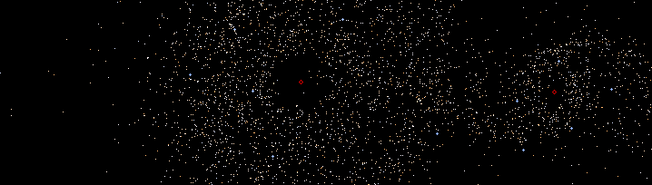

  

> [n=4000 Δt=0.0025, sped up 30x. Actual recording time is 15.5 mins.](https://github.com/Andallfor/Barnes-Hut-Simulation/blob/main/out.mp4)
# Barnes-Hut Simulator
This is a small, performant project that implements the Barnes-Hut algorithm in C++ using Dear ImGUI as the visual display. The project was primarily designed as an education project for myself.  

# Features
1. **Leapfrog integration** (default Δt = 0.0025) is used to calculated each body's position from applied force.
2. **Incremental center of mass calculations** instead of needing to re-traverse all children nodes. For example, the removal of a child node will automatically apply the correct new CoM to all of its parent nodes, rather then needing to request the parent to recalculate their CoM.
3. **Direct access to bodies** via caching them into an array. The quad tree structure is used when calculating body forces while this cache is used for optimized drawing and actually applying the force (i.e. when calculating leapfrog integration).
4. **Tail recursion during body insertion** into quad tree. While not strictly necessary (and technically slightly harms performance), this helps prevent stack overflows when two bodies collide.
5. **Atan2 approximation**. This can be disabled through the USE_ATAN2_APPROX directive in [body.cpp](src/body.cpp).

# Improvements
1. Primary slowdown is in body::isLeaf() call. This should instead be saved and only updated when the body is inserted/moving within the quadtree.
2. Implement body merging when close to another body. This will prevent superluminal speeds and reduce tree depth due to two bodies being very close to each other.
3. When a body exits a quad bounds, the program currently fully removes it from the scenario before re-adding it in order to maintain CoM correctness (as this was initially written before I added the incrementing CoM methods). This can be simplified by searching upwards from current node to find the parent node that encloses the new position, then adding itself starting from that parent node as reference.
4. Research actual galactic trends instead of making up most of the data.

# Primary Sources
Some sections of code are adapted from other sources; these are linked in the source code comments.
1. [Algorithm reference](http://arborjs.org/docs/barnes-hut)
2. [Math reference 1](https://beltoforion.de/en/barnes-hut-galaxy-simulator/)
2. [Math reference 2](https://en.wikipedia.org/wiki/Leapfrog_integration)
